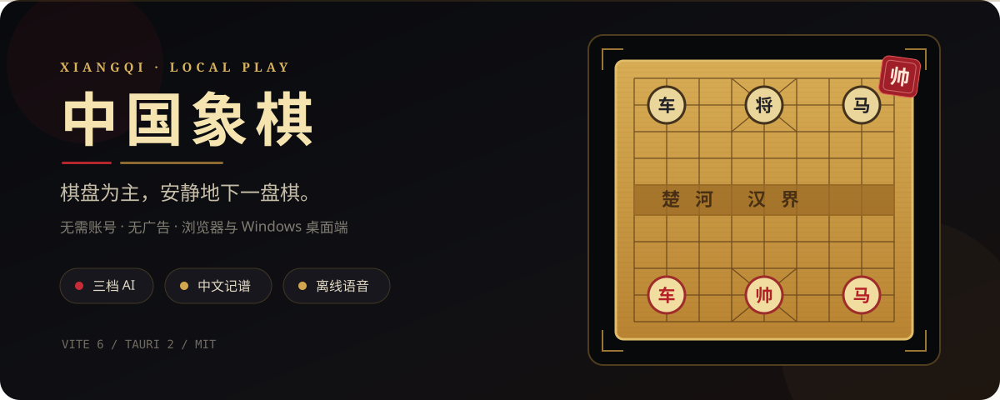
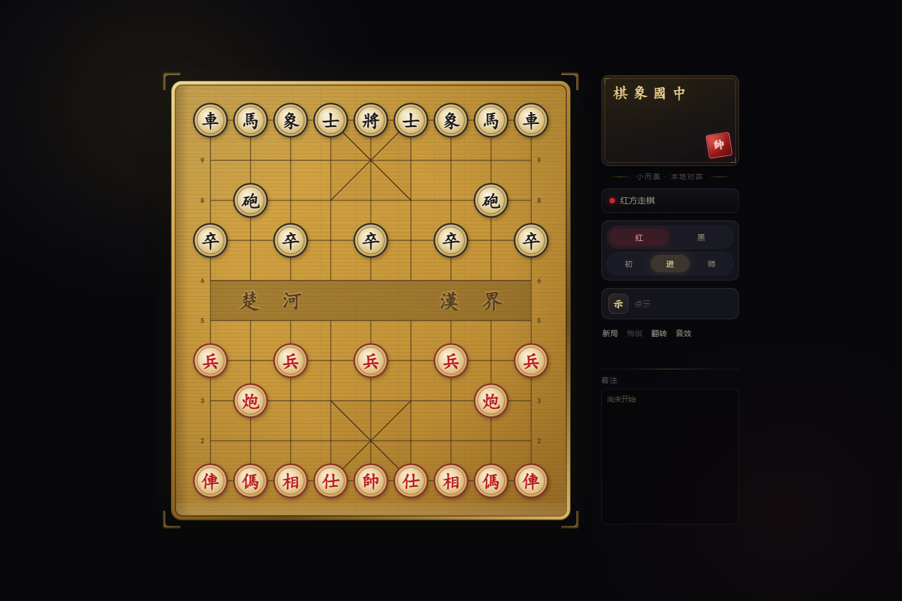

<p align="center">
  
</p>

<p align="center">
  <a href="https://github.com/hkm-a/xiangqi/releases/latest"></a>
  <a href="https://github.com/hkm-a/xiangqi/actions/workflows/ci.yml"></a>
  
  <a href="./LICENSE"></a>
</p>

<p align="center">
  <strong>棋盘为主，安静地下一盘棋。</strong><br>
  无需账号、没有广告；浏览器可离线安装，也可作为轻量 Windows 桌面应用运行。
</p>

<p align="center">
  <a href="https://github.com/hkm-a/xiangqi/releases/latest"><strong>下载 Windows 版</strong></a>
  ·
  <a href="#本地运行"><strong>在浏览器中运行</strong></a>
  ·
  <a href="./docs/RELEASE.md"><strong>查看发版说明</strong></a>
</p>

<p align="center">
  
</p>

## 一盘棋需要的，刚刚好

| 能力 | 实际体验 |
| --- | --- |
| **规则与终局** | 合法走法、将军、将杀、困毙、三次重复与长将判定 |
| **三档 AI** | 初学、进阶、大师三档；搜索放在 Worker 中，不阻塞棋盘交互 |
| **两种走棋方式** | 点击或拖拽棋子，合法落点、提示箭头和将军朱印即时反馈 |
| **中文棋局表达** | 中文记谱、着法复制、被吃子记录，以及本地中文语音播报 |
| **本地优先** | 对局不上传；设置只写入浏览器本地存储，预生成语音可离线使用 |
| **双形态安装** | 浏览器可安装为 PWA；Windows 可下载约 2 MB 的 NSIS 安装包 |

AI 使用迭代加深、Alpha-Beta、Zobrist 置换表、MVV-LVA 和静默搜索。提示默认不自动计算，只有点击「示」或按 `H` 时才开始分析。

## 本地运行

需要 Node.js 18+。仓库已经包含预生成的中文语音资源，无需先联网生成音频。

```bash
git clone https://github.com/hkm-a/xiangqi.git
cd xiangqi
npm ci
npm run dev
```

打开 `http://localhost:3000` 即可开始。生产构建与预览：

```bash
npm run build
npm run preview
```

生产环境会注册 Service Worker。首次载入完成后，可在 Chrome 或 Edge 地址栏选择「安装」，以独立窗口离线运行。

## 如何操作

| 场景 | 操作 |
| --- | --- |
| 走棋 | 点击起点与终点，或直接拖拽棋子 |
| 选择执方 | 选择「红」或「黑」后开始新局 |
| 调整难度 | 「初」/「进」/「师」对应三档搜索深度 |
| 请求提示 | 点击「示」或按 `H`，棋盘显示建议箭头 |
| 导出着法 | 点击「复制」、双击着法区或按 `C` |

快捷键：`N` 新局 · `U`/`Z` 悔棋 · `F` 翻转 · `H` 提示 · `M` 音效 · `C` 复制着法 · `Esc` 取消选择。

## 运行方式

```text
点击 / 拖拽 / 快捷键
          ↓
      对局控制器
   ┌──────┼────────┐
   ↓      ↓        ↓
规则引擎  Canvas   AI Worker
记谱/FEN  棋盘反馈  三档搜索
   └──────┼────────┘
          ↓
  本地偏好 · 离线语音
          ↓
 浏览器/PWA 或 Tauri 桌面端
```

- 浏览器端不需要服务端，设置保存在 `localStorage`。
- PWA 的 Service Worker 只缓存静态资源与语音片段。
- Tauri 桌面端使用同一份 Vite 产物，启动后从 GitHub Release 检查更新。

## Windows 桌面端

普通用户可直接前往 [最新 Release](https://github.com/hkm-a/xiangqi/releases/latest) 下载安装包。自行构建需要 Rust 与系统 WebView2：

```bash
npm ci
npm run desktop:dev
npm run desktop:build
```

日常本地构建会生成便携可执行文件和未签名的 NSIS 安装包，不需要发布私钥。正式 Release 会叠加发布配置，生成 updater 签名和 `latest.json`；完整流程见 [发版与自动更新](./docs/RELEASE.md)。

## 产品边界

这个项目专注本地人机对弈，不计划加入账号、广告、联网对战、排行榜、开局库或多主题皮肤。当前只保存执方、难度、音效等偏好，不自动恢复中断的棋局。

桌面端仅在检查更新时访问 GitHub；浏览器版除首次加载静态资源外，不需要外部服务。项目不使用外链字体。

## 项目结构

```text
js/            规则、记谱、对局、AI、渲染与语音
css/           暗色主题与响应式布局
public/        图标、PWA 清单、Service Worker 与语音片段
src-tauri/     Tauri 2 桌面壳
scripts/       语音生成与桌面快捷方式脚本
tests/         Vitest 单元测试
index.html     应用入口
```

## 开发与验证

```bash
npm run lint
npm test
npm run build
cargo test --manifest-path src-tauri/Cargo.toml
```

当前测试覆盖棋子走法、将军/终局、FEN、记谱、AI 评估、重复局面、悔棋和语音队列等关键路径。

## 许可证

[MIT](./LICENSE)
